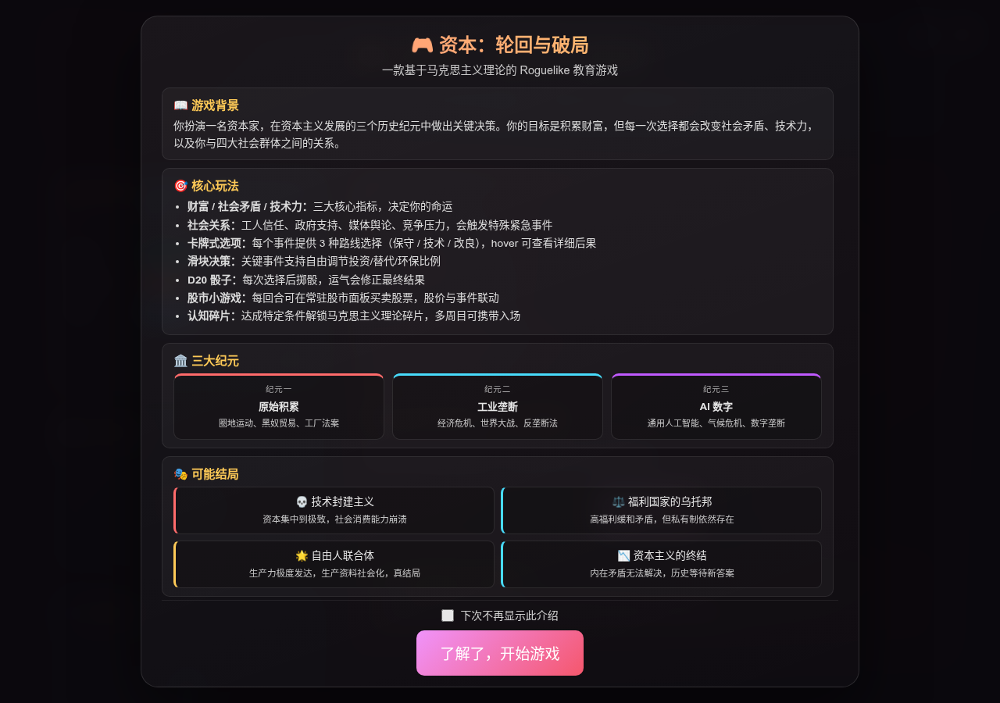
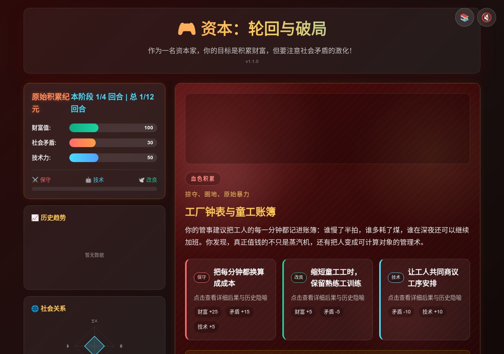
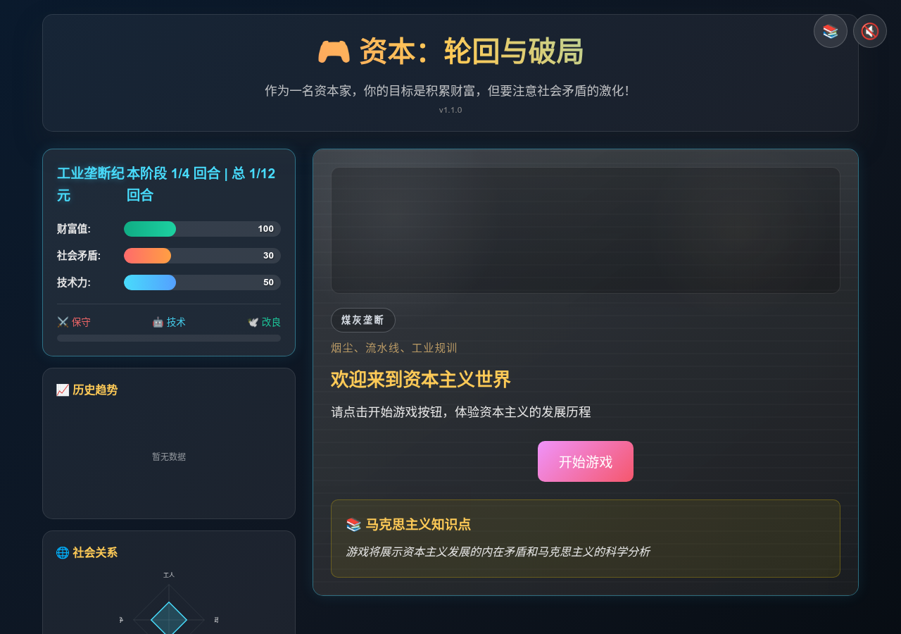
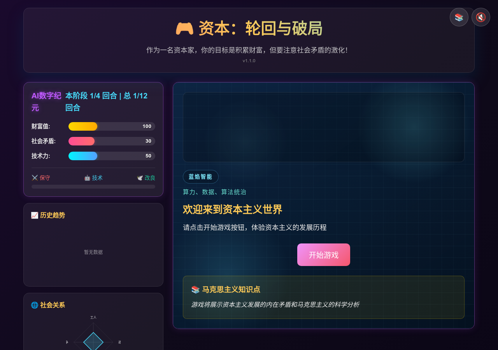

# 资本：轮回与破局

[](./CHANGELOG.md)

一款基于马克思主义理论的 Roguelike 教育游戏，通过模拟资本主义发展历程，展示唯物史观、剩余价值理论等核心原理。

---

## 🎮 游戏简介

你扮演一名资本家，在三个历史纪元中做出关键决策：
- **原始积累纪元**：圈地运动、黑奴贸易、工厂法案
- **工业垄断纪元**：经济危机、工人运动、帝国主义战争
- **AI 数字纪元**：通用人工智能、全球气候危机、数字垄断

每一次选择都会影响你的**财富**、**社会矛盾**、**技术力**以及与四大社会群体的**关系**（工人、政府、媒体、竞争对手）。游戏结束时，根据你的累计数值与路线倾向，将触发不同结局：
- **技术封建主义**（Bad Ending）
- **福利国家的乌托邦**（Normal Ending）
- **自由人联合体**（True Ending）

---

## 🚀 快速开始

### 前置要求
- 现代浏览器（Chrome / Firefox / Edge）
- 本地 HTTP 服务器（因为使用 ES Modules）

### 一键启动

**Windows**
```bash
tools\start.bat
```

**Linux / macOS**
```bash
bash tools/start.sh
# 或
python -m http.server 8080
```

然后浏览器访问 `http://localhost:8080` 即可游玩。

---

## 📁 项目结构

```
├── index.html              # 游戏入口页面
├── css/                    # 样式文件
│   ├── base.css
│   ├── themes.css
│   ├── components.css      # 卡牌、滑块、进度条
│   ├── modals.css
│   ├── effects.css         # 动画与视觉特效
│   └── layout.css          # 双栏布局、响应式
├── js/                     # JavaScript 源码（ES Modules）
│   ├── main.js             # 入口
│   ├── config.js           # 常量与游戏配置
│   ├── data/               # 数据层
│   │   ├── assets.js       # 事件 SVG 图库
│   │   ├── events.js       # 事件库（YAML 加载器）
│   │   ├── fragments.js    # 认知碎片（YAML 加载器）
│   │   ├── achievements.js # 成就（YAML 加载器）
│   │   ├── loader.js       # YAML 配置加载器
│   │   ├── achievementChecks.js # 成就检查函数库
│   │   └── conditionFns.js  # 碎片条件函数库
│   ├── core/               # 核心引擎
│   │   ├── AudioManager.js # 背景音乐与音效管理
│   │   └── GameEngine.js   # 主游戏类
│   └── utils/
│       └── helpers.js      # SVG 生成器、工具函数
├── yaml/                   # YAML 配置文件（数据与逻辑分离）
│   ├── images.yaml         # SVG 图库配置
│   ├── achievements.yaml   # 成就配置
│   ├── fragments.yaml      # 认知碎片配置
│   └── events/             # 事件配置
│       ├── epoch1.yaml     # 纪元1事件（12个）
│       ├── epoch2.yaml     # 纪元2事件（12个）
│       ├── epoch3.yaml     # 纪元3事件（12个）
│       ├── route.yaml      # 路线专属事件
│       ├── hidden.yaml     # 隐藏连锁事件
│       └── special.yaml    # 特殊事件
├── assets/
│   ├── screenshots/        # 游戏截图
│   └── audio/              # 纪元背景音乐 MP3
├── docs/                   # 开发文档
│   ├── ARCHITECTURE.md
│   ├── ADD_EVENT.md
│   └── ADD_MODE.md
├── tools/                  # 启动脚本
│   ├── start.bat
│   ├── start.sh
│   ├── launch.bat
│   └── run_game_simple.bat
├── tests/                  # 测试截图与用例
│   └── screenshots/
└── legacy/                 # 历史文件
    └── capital_game_enhanced.py
```

---

## ✨ 核心特色

- **双栏仪表盘布局**：左侧实时显示趋势折线图与社会关系雷达图，右侧进行事件决策
- **卡牌式选项**：每个事件选项以卡片形式呈现，hover 展开显示历史隐喻与数值影响
- **滑块决策**：关键事件（技术革命、AI 取代人力、气候危机）支持滑块输入，实时预览影响
- **股市小游戏**：常驻股市面板，根据市场走势买卖股票，财富细分为现金与股票市值
- **纪元背景音乐**：三个纪元配有差异化 MP3 背景音乐（原始积累低沉/工业垄断机械/AI 数字电子），支持淡入淡出切换
- **纪元过渡特效**：蒸汽朋克齿轮（1→2）与数字雨电路板（2→3）SVG 动画
- **Tab 式结局面板**：结局诊断 / 数据报告 / 历史回顾 / 成就与碎片，四个标签分类展示
- **D20 骰子修正**：每次选择后掷骰，为决策结果增添 Roguelike 随机性
- **跨局继承**：认知碎片与成就会保存在 `localStorage` 中，多周目持续解锁
- **YAML 配置化**：游戏数据（事件、成就、认知碎片）存储在 YAML 配置文件中，便于维护和扩展

---

## 🖼️ 游戏截图

### 游戏介绍面板


### 游戏主界面（事件决策 + 常驻股市）


### 纪元主题切换




---

## 🛠️ 开发文档

- [架构说明](./docs/ARCHITECTURE.md)
- [如何添加新事件](./docs/ADD_EVENT.md)
- [如何添加新模式](./docs/ADD_MODE.md)
- [更新日志](./CHANGELOG.md)

---

## 📜 许可证

本项目为课程作业与开源教育项目，欢迎自由学习与二次创作。
